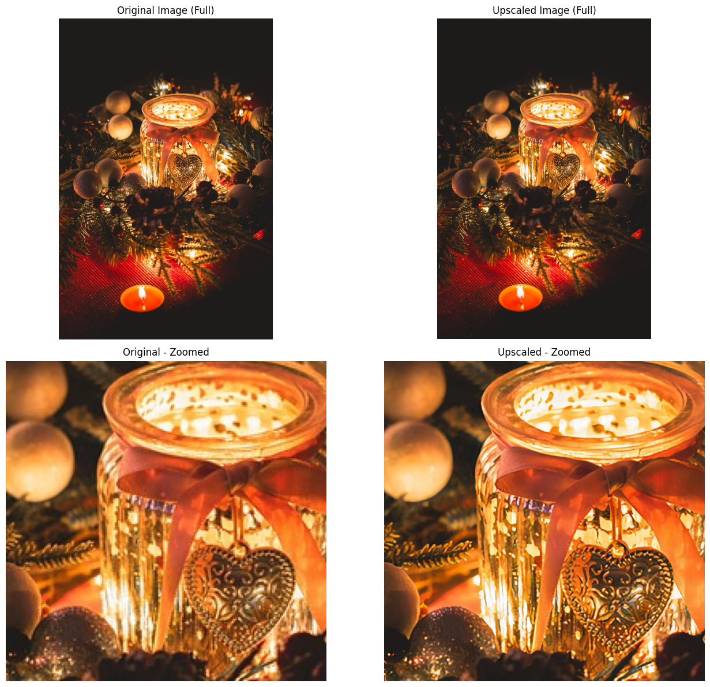
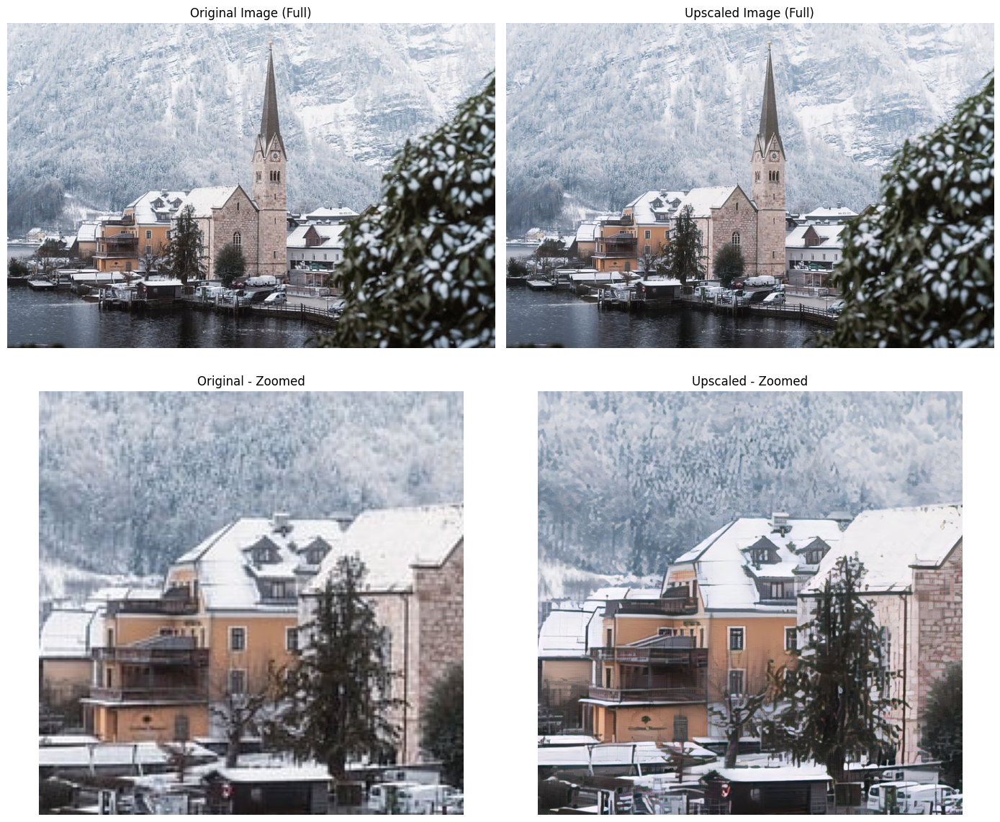

# ESRGAN - Enhanced Super-Resolution Generative Adversarial Network

A PyTorch implementation of ESRGAN for 4× image super-resolution, trained on DIV2K, Flickr2K, and ISR datasets.




## Overview

This project implements **ESRGAN (Enhanced Super-Resolution GAN)** with the **RRDBNet** (Residual-in-Residual Dense Block Network) architecture. The model performs **4× upscaling** of low-resolution images while preserving fine details and generating perceptually realistic textures.

### Key Features
- **Two-phase training**: PSNR-oriented pretraining followed by GAN-based perceptual refinement
- **Relativistic Average GAN (RaGAN)** loss for stable adversarial training
- **Perceptual loss** using VGG19 features
- **Spectral normalization** in discriminator for training stability
- **Mixed precision training** with automatic gradient scaling
- **Progressive GAN weight warmup** to prevent early instability

---

## Quick Start

### Installation

This project uses [uv](https://github.com/astral-sh/uv) for dependency management.

```bash
# Clone the repository
git clone <your-repo-url>
cd ESRGAN

# Install dependencies with uv
uv sync
```

### Inference

Use the provided Jupyter notebook for easy inference:

- **upscale.ipynb**

Or run programmatically:

```python
import torch
from PIL import Image
from src.esrgan import RRDBNet
import torchvision.transforms.functional as F

device = "cuda" if torch.cuda.is_available() else "cpu"

# Load model
generator = RRDBNet().to(device)
generator.load_state_dict(torch.load("models/ESRGAN.pth", map_location=device))
generator.eval()

# Upscale image
lr_img = Image.open("input.jpg").convert("RGB")
lr_tensor = F.to_tensor(lr_img).unsqueeze(0).to(device)

with torch.no_grad():
    sr_tensor = generator(lr_tensor)

sr_img = F.to_pil_image(sr_tensor.squeeze(0).cpu())
sr_img.save("output.png")
```

**Important**: Always use `models/ESRGAN.pth` (the fully trained model), not `ESRGAN_PSNR.pth` (which is only Phase 1).

---

## Architecture

### Generator: RRDBNet
- **23 RRDB blocks** (Residual-in-Residual Dense Blocks)
- Each RRDB contains 3 Dense Residual Blocks (DRBs)
- Dense connections within blocks for better gradient flow
- Residual scaling factor of 0.2 for training stability
- **PixelShuffle upsampling** (2×2) for 4× total upscaling
- ~16.7M parameters

### Discriminator
- VGG-style architecture with **Spectral Normalization**
- PatchGAN output (predicts real/fake for image patches)
- Progressive downsampling: 4 stride-2 convolutions
- No batch normalization (spectral norm provides regularization)

---

## Training

### Dataset Structure

```
data/
├── DIV2K/
│   ├── hr_images/    # 800 high-res images (bicubic downsampled)
│   └── lr_images/    # Corresponding low-res images
├── Flickr2K/
│   ├── hr_images/    # 2,650 images (mixed degradation)
│   └── lr_images/
├── ISR/
│   ├── hr_images/    # 1,254 images (bicubic downsampled)
│   └── lr_images/
└── Validation/
    └── hr_images/    # Validation set
```

**Total training images**: 4,704

### Training Phases

#### Phase 1: PSNR Pretraining (100 epochs)
- **Objective**: Pixel-wise reconstruction (L1 loss only)
- **Learning rate**: 2e-4
- **Target**: ~26-27 dB validation PSNR
- **Purpose**: Establish strong baseline for content fidelity

#### Phase 2: GAN Refinement (40-100 epochs)
- **Losses**: Pixel (1.0) + Perceptual (1.0) + GAN (0.005) + Color (0.05)
- **GAN weight warmup**: Linearly increases over first 20 epochs
- **Learning rates**: Generator (2e-4), Discriminator (2e-4)
- **LR decay**: 0.5× at 50%, 75%, 90% of GAN epochs
- **Purpose**: Add perceptual quality while preserving PSNR

### Run Training

```bash
cd src
python train.py
```

**Key hyperparameters** in `train.py`:
```python
BATCH_SIZE = 10
PSNR_EPOCHS = 100
GAN_EPOCHS = 100
LOSS_WEIGHTS = {
    'pixel': 1.0,
    'perceptual': 1.0,
    'gan': 0.005,     # keeps GAN subtle
    'color': 0.05,
}
```

---

## Monitoring Training

### Healthy Training Indicators

#### Phase 1 (PSNR)
- **Validation PSNR**: Should reach 26-27 dB by epoch 100
- **Pixel loss**: Steadily decreasing from ~0.08 → ~0.04

#### Phase 2 (GAN)
Monitor these metrics every 5 epochs:

| Metric | Healthy Range | Warning Signs |
|--------|---------------|---------------|
| **Validation PSNR** | 25.5-27.0 dB | Dropping below 25.0 dB |
| **D Loss** | 0.55-0.75 | <0.4 (too weak) or >0.85 (too strong) |
| **GAN Loss** | 0.6-1.2 | <0.5 (G winning) or >1.5 (D winning) |
| **Pixel Loss** | 0.045-0.055 | Increasing over time |

### Common Issues & Solutions

#### 🔴 Problem: PSNR Degrading (25.7 → 24.5 → 23.0 dB)
**Cause**: GAN weight too high, perceptual losses overwhelming reconstruction

**Solution**:
```python
# In train.py, reduce GAN weight
LOSS_WEIGHTS = {
    'gan': 0.002,  # Reduced from 0.005
}
```

#### 🔴 Problem: Discriminator Collapse (D Loss → 0.3)
**Symptoms**: D loss dropping, GAN loss spiking (>1.5)

**Cause**: Discriminator too weak to provide useful gradients

**Solution**:
```python
# Boost discriminator learning rate temporarily
d_opt = Adam(discriminator.parameters(), lr=3e-4)  # Was 2e-4
g_opt = Adam(generator.parameters(), lr=1e-4)      # Lower generator
```

Or reload discriminator from earlier checkpoint:
```python
CHECKPOINT_PATH_D = 'checkpoints/discriminator_epoch_140.pth'  # Healthy epoch
```

#### 🔴 Problem: Generator Collapse (GAN Loss → 0.3)
**Symptoms**: GAN loss too low, discriminator winning easily

**Solution**:
```python
# Lower discriminator LR
d_opt = Adam(discriminator.parameters(), lr=5e-5)  # Was 2e-4
```

#### 🔴 Problem: Training Stagnation
**Symptoms**: All losses flat for 20+ epochs

**Solution**:
1. Reduce learning rates by 0.5×
2. Increase GAN weight slightly (0.005 → 0.008)
3. Check validation samples visually for quality

---

## Expected Results

### Final Metrics (After 200 epochs total)
- **Validation PSNR**: 25.5-26.0 dB
- **Perceptual quality**: Sharp edges, realistic textures
- **Color accuracy**: Minimal color shift from original
---

## Project Structure

```
ESRGAN/
├── src/
│   ├── __init__.py
│   ├── train.py          # Main training loop
│   ├── esrgan.py         # Generator & discriminator architectures
│   ├── losses.py         # Loss functions (pixel, perceptual, GAN)
│   ├── dataloader.py     # Dataset loading & augmentation
│   └── checkpoint.py     # Save/load training state
├── models/
│   ├── ESRGAN.pth        # Final trained model (USE THIS)
│   └── ESRGAN_PSNR.pth   # Phase 1 checkpoint (reference only)
├── checkpoints/          # Training checkpoints (auto-saved)
├── data/                 # Training datasets
├── images/               # Example images & outputs
├── val_output/           # Validation samples during training
├── demo_1.png            # Demo: Original vs Upscaled (zoomed)
├── demo_2.png            # Demo: Original vs Upscaled (zoomed)
├── demo_3.png            # Demo: Original vs Upscaled (zoomed)
├── upscale.ipynb         # Inference notebook
├── pyproject.toml        # uv dependencies
└── README.md
```

---

## Advanced Configuration

### Data Augmentation

In `dataloader.py`, training images receive:
- **JPEG compression** (quality: 80-95, probability: 30-60%)
- **Gaussian noise** (σ: 0.002-0.007, probability: 30-50%)
- **Geometric augmentations**: Horizontal/vertical flips, 90° rotations

Validation images receive light degradation (deterministic per image) to match training distribution.

### Gradient Management
- **Generator**: Gradient clipping at norm 10.0
- **Discriminator**: Gradient clipping at norm 1.0 (tighter to prevent collapse)
- **Mixed precision**: AMP with GradScaler for faster training

### Resume Training

```python
RESUME_FROM_CHECKPOINT = True
CHECKPOINT_PATH_G = 'checkpoints/generator_epoch_140.pth'
CHECKPOINT_PATH_D = 'checkpoints/discriminator_epoch_140.pth'
```

Checkpoints include:
- Model weights
- Optimizer state
- GradScaler state
- RNG state (for reproducibility)
- Iteration count

---

## Troubleshooting

### CUDA Out of Memory
```python
BATCH_SIZE = 6  # Reduce from 10
```

### Slow Training
- Ensure `num_workers=4` in dataloaders
- Use `pin_memory=True` for GPU training
- Enable `persistent_workers=True`

### Poor Validation PSNR After Phase 1
- Check dataset HR/LR correspondence (should be 4× size difference)
- Verify images are properly preprocessed (RGB, correct sizes)
- Increase PSNR epochs to 150 if needed

### Artifacts in Output
- Reduce GAN weight (0.005 → 0.003)
- Load earlier checkpoint with better PSNR
- Increase pixel loss weight (1.0 → 1.5)

---